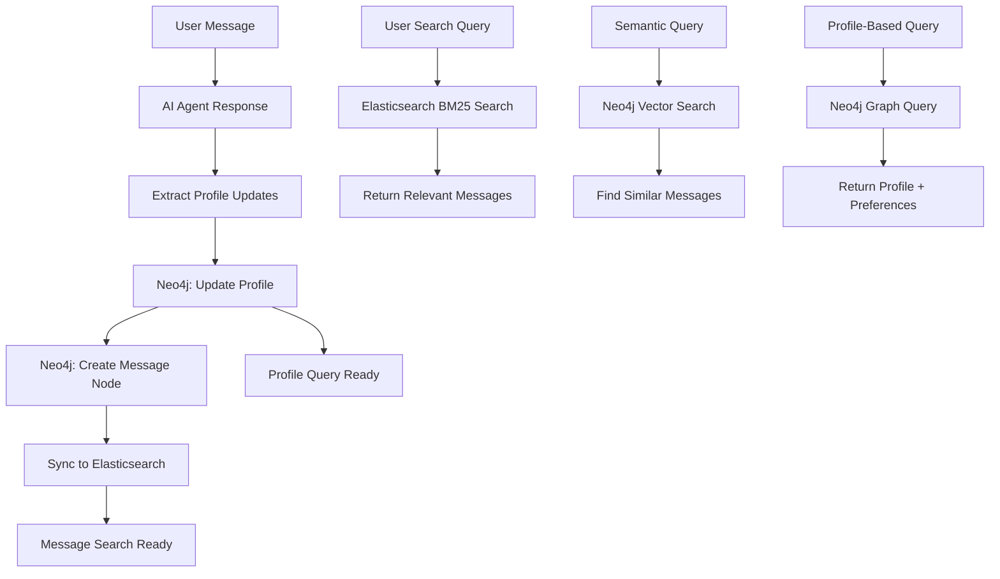

# Research: Hybrid Search Architecture for Conversational AI

## Problem Statement

Current architecture:
- User profiles stored in Neo4j (nodes + relationships)
- Message history stored in relationships (not searchable by content)
- AI agent has full profile context injected, but no message history search

Goal:
- Fast text search across all messages
- Profile enrichment after each conversation
- Scalable architecture for many clients/conversations

---

## Part 1: Architecture Overview

```
┌─────────────────────────────────────────────────────────────────────────────┐
│                         Recommended Hybrid Architecture                      │
├─────────────────────────────────────────────────────────────────────────────┤
│                                                                              │
│  Client          AI Agent              Neo4j              Elasticsearch     │
│  ───────         ────────             ──────              ─────────────     │
│                                                                              │
│    │               │                    │                     │              │
│    │  1. Message   │                    │                     │              │
│    │──────────────▶│                    │                     │              │
│    │               │                    │                     │              │
│    │               │  2. Profile Query  │                     │              │
│    │               │───────────────────▶│                     │              │
│    │               │                    │                     │              │
│    │               │  3. Profile Data   │                     │              │
│    │               │◀───────────────────│                     │              │
│    │               │                    │                     │              │
│    │               │  4. AI Response    │                     │              │
│    │◀──────────────│                    │                     │              │
│    │               │                    │                     │              │
│    │               │  5. Extract Insights                     │              │
│    │               │  6. Update Profile   │                     │              │
│    │               │────────────────────▶│                     │              │
│    │               │                    │                     │              │
│    │               │  7. Sync to ES      │                     │              │
│    │               │─────────────────────────────────────────▶│              │
│    │               │                    │                     │              │
│    └───────────────┴────────────────────┴─────────────────────┘              │
│                                                                              │
└─────────────────────────────────────────────────────────────────────────────┘
```

---

## Part 2: Neo4j → Elasticsearch Sync Pipeline

### Option A: Change Data Capture (CDC) with Neo4j Streams

```yaml
# docker-compose.yml
services:
  neo4j:
    image: neo4j:5.12
    environment:
      NEO4J Streams CDC_ENABLED: "true"
      NEO4J Streams CDC_POLICY_NAME: "messages-policy"
    volumes:
      - ./cdc-policy.conf:/cdc-policy.conf

  kafka:
    image: confluentinc/cp-kafka:7.5.0

  elasticsearch:
    image: docker.elastic.co/elasticsearch/elasticsearch:8.11.0

  sync-service:
    build: ./sync-service
    environment:
      KAFKA_BOOTSTRAP_SERVERS: kafka:9092
      ELASTICSEARCH_URL: http://elasticsearch:9200
```

```cypher
# Neo4j CDC Policy (messages-policy.conf)
[{
  "topic": "neo4j.messages",
  "payload": {
    "after": {
      "labels": ["Message"],
      "properties": ["message_id", "user_id", "conversation_id", "text", "timestamp"]
    }
  }
}, {
  "topic": "neo4j.profile_updates",
  "payload": {
    "after": {
      "labels": ["UserProfile"],
      "properties": ["user_id", "preferences", "segments", "last_updated"]
    }
  }
}]
```

```python
# sync-service/app.py (Kafka → Elasticsearch consumer)
from kafka import KafkaConsumer
from elasticsearch import Elasticsearch
import json

consumer = KafkaConsumer(
    'neo4j.messages',
    bootstrap_servers='kafka:9092',
    value_deserializer=lambda x: json.loads(x.decode('utf-8'))
)

es = Elasticsearch(['http://elasticsearch:9200'])

def sync_message_to_elasticsearch(record):
    doc = {
        'message_id': record['message_id'],
        'user_id': record['user_id'],
        'conversation_id': record['conversation_id'],
        'message_text': record['text'],
        'timestamp': record['timestamp'],
        'indexed_at': datetime.utcnow().isoformat()
    }
    es.index(index='messages', id=record['message_id'], document=doc)

for message in consumer:
    sync_message_to_elasticsearch(message.value)
```

### Option B: Direct Neo4j → ES Query (Simpler)

```python
# sync-service/direct_sync.py
from neo4j import GraphDatabase
from elasticsearch import Elasticsearch

neo4j = GraphDatabase.driver("bolt://neo4j:7687", auth=("neo4j", "password"))
es = Elasticsearch(['http://elasticsearch:9200'])

def sync_recent_messages(hours=24):
    """Sync messages from the last N hours to Elasticsearch."""
    with neo4j.session() as session:
        result = session.run("""
            MATCH (u:User)-[:SENT]->(m:Message)
            WHERE m.timestamp >= datetime() - duration({hours: $hours})
            RETURN m.message_id AS id, u.user_id AS user_id, 
                   m.text AS text, m.timestamp AS timestamp,
                   m.conversation_id AS conversation_id
        """, hours=hours)
        
        for record in result:
            es.index(
                index='messages',
                id=record['id'],
                document={
                    'message_id': record['id'],
                    'user_id': record['user_id'],
                    'message_text': record['text'],
                    'timestamp': record['timestamp'].isoformat(),
                    'conversation_id': record['conversation_id']
                }
            )

# Run every 5 minutes via cron
if __name__ == "__main__":
    sync_recent_messages(hours=1)
```

### Option C: Neo4j GDS + Elasticsearch Integration (Advanced)

```cypher
// Neo4j: Generate embeddings for semantic search
MATCH (m:Message)
WHERE m.embedding IS NULL
WITH m LIMIT 1000
CALL genai.vector.encode(
  m.text, 
  "OpenAI", 
  {apiKey: $api_key}
) YIELD vector
SET m.embedding = vector

// Store embeddings in Neo4j vector index
CREATE VECTOR INDEX message_embeddings 
FOR (m:Message) ON (m.embedding)
OPTIONS {indexConfig: {
    `vector.dimensions`: 1536,
    `vector.similarity_function`: 'cosine'
}}
```

### Elasticsearch Index Mapping

```json
PUT /messages
{
  "settings": {
    "number_of_shards": 3,
    "number_of_replicas": 1,
    "analysis": {
      "analyzer": {
        "message_analyzer": {
          "type": "custom",
          "tokenizer": "standard",
          "filter": ["lowercase", "porter_stem"]
        }
      }
    }
  },
  "mappings": {
    "properties": {
      "message_id": { "type": "keyword" },
      "user_id": { "type": "keyword" },
      "conversation_id": { "type": "keyword" },
      "message_text": { 
        "type": "text",
        "analyzer": "message_analyzer",
        "fields": {
          "keyword": { "type": "keyword" }
        }
      },
      "timestamp": { "type": "date" },
      "extracted_entities": { "type": "keyword" },
      "embedding": { "type": "dense_vector", "dims": 1536 }
    }
  }
}
```

---

## Part 3: Profile Expansion After Conversation

### The Workflow

```
Session Start                    Session End
    │                               │
    │  1. Load Current Profile      │  2. Analyze Conversation
    │  (Neo4j: User → Preferences)  │     - Extract new preferences
    │                               │     - Update segments
    │                               │
    ▼                               ▼
┌─────────┐                  ┌─────────────────┐
│ Profile │                  │ Profile Updates │
│ (Before)│                  │ (After)         │
└─────────┘                  └─────────────────┘
                                      │
                                      ▼ 3. Write Back to Neo4j
                               ┌─────────────────┐
                               │ Expanded Profile│
                               │ (Enhanced)      │
                               └─────────────────┘
```

### Profile Expansion Examples

#### Example 1: Extracted Preference

```cypher
// BEFORE (Neo4j)
CREATE (u:User {user_id: "user_123", name: "John"})
CREATE (u)-[:HAS]->(p:Preference {category: "dietary", value: "vegetarian"})
CREATE (u)-[:HAS]->(s:Segment {name: "health_concious"})

// CONVERSATION:
// User: "I've started going to the gym 3x a week"
// User: "I'm trying to eat more protein"

// AFTER (Extract and store new preferences)
MATCH (u:User {user_id: "user_123"})
SET u.last_activity = datetime()

// Create new preference nodes
CREATE (u)-[:HAS]->(new_pref_1:FitnessPreference {
  category: "workout_frequency",
  value: "3_times_weekly",
  confidence: 0.85,
  source: "conversation_2026_01_28",
  extracted_at: datetime()
})

CREATE (u)-[:HAS]->(new_pref_2:NutritionPreference {
  category: "protein_focus",
  value: "high_protein",
  confidence: 0.80,
  source: "conversation_2026_01_28",
  extracted_at: datetime()
})

// Update segment
MERGE (u)-[:BELONGS_TO]->(s2:Segment {name: "fitness_enthusiast"})
SET s2.confidence = coalesce(s2.confidence, 0) + 0.15
```

#### Example 2: Preference Conflict Resolution

```cypher
// BEFORE: User has conflicting preferences
MATCH (u:User {user_id: "user_123"})-[:HAS]->(pref:Preference {category: "dietary"})
SET pref.value = "vegetarian"

// CONVERSATION:
// User: "I had salmon for dinner"

// NEW EXTRACTED PREFERENCE
MATCH (u:User {user_id: "user_123"})
CREATE (u)-[:HAS_PAST]->(pref_hist:FishingPreference {
  category: "dietary_past",
  value: "eats_fish",
  confidence: 0.75,
  timestamp: datetime(),
  original_belief: "vegetarian"
})

// Option A: Keep as separate "past behavior" node
// Option B: Update confidence score for vegetarian → flexitarian
SET pref.confidence = pref.confidence - 0.25
SET pref.value = "flexitarian"
SET pref.updated_at = datetime()
SET pref.update_reason = "contradicting evidence from conversation"
```

#### Example 3: Multi-Property Profile Expansion

```cypher
// BEFORE: Minimal profile
CREATE (u:UserProfile {
  user_id: "user_456",
  created_at: datetime("2026-01-01"),
  last_session: datetime("2026-01-15")
})

// CONVERSATION:
// User: "I'm planning a trip to Japan in March"
// User: "Looking for hotel recommendations near Shibuya"
// User: "Also need vegetarian restaurants"

// AFTER: Expand profile with travel + dining preferences
MATCH (u:UserProfile {user_id: "user_456"})

// Travel preferences
CREATE (u)-[:HAS]->(t:TravelPreference {
  category: "destination",
  value: "japan",
  confidence: 0.90,
  source: "conversation_2026_01_28",
  extracted_at: datetime()
})

CREATE (u)-[:HAS]->(t2:TravelPreference {
  category: "travel_timeline",
  value: "march_2026",
  confidence: 0.85,
  source: "conversation_2026_01_28",
  extracted_at: datetime()
})

// Dining preferences
CREATE (u)-[:HAS]->(d:DiningPreference {
  category: "location_dining",
  value: "shibuya_japan",
  confidence: 0.75,
  source: "conversation_2026_01_28",
  extracted_at: datetime()
})

CREATE (u)-[:HAS]->(d2:DiningPreference {
  category: "dietary",
  value: "vegetarian",
  confidence: 0.95,
  source: "conversation_2026_01_28",
  extracted_at: datetime()
})

// Update session timestamp
SET u.last_session = datetime()
SET u.total_conversations = coalesce(u.total_conversations, 0) + 1
```

### AI Agent Profile Extraction Prompt

```python
EXTRACTION_PROMPT = """
You are analyzing a conversation to extract user profile information.

## Current Profile (for reference):
{profile_context}

## Conversation Transcript:
{conversation_transcript}

## Instructions:
1. Extract NEW preferences that the user mentioned
2. Detect CHANGES to existing preferences
3. Note CONTRADICTIONS with known preferences
4. Assign confidence scores (0.5-1.0)

## Output Format (JSON):
{{
  "new_preferences": [
    {{
      "category": "dietary",
      "value": "vegetarian",
      "confidence": 0.85,
      "evidence": "User explicitly stated 'I am vegetarian'"
    }}
  ],
  "updated_preferences": [
    {{
      "category": "workout",
      "old_value": "2x weekly",
      "new_value": "3x weekly",
      "confidence": 0.75,
      "reason": "User mentioned starting gym 3x a week"
    }}
  ],
  "contradictions": [
    {{
      "existing_value": "vegetarian",
      "new_evidence": "User mentioned eating salmon",
      "recommendation": "update to flexitarian or add as past behavior"
    }}
  ],
  "segments": ["health_concious", "fitness_enthusiast"]
}}

## Rules:
- Only extract if user EXPLICITLY stated or clearly implied
- Set confidence lower if evidence is weak
- Always reference conversation lines for traceability
"""
```

---

## Part 4: Ideal End-to-End Workflow

### Complete Pipeline



### Workflow Steps

| Step | Action | Storage | Timing |
|------|--------|---------|--------|
| 1 | User sends message | - | Real-time |
| 2 | AI agent queries profile | Neo4j | Per request |
| 3 | AI generates response | - | Real-time |
| 4 | Extract profile updates | AI | Per session end |
| 5 | Write profile to Neo4j | Neo4j | Per session end |
| 6 | Create message node | Neo4j | Per session end |
| 7 | Sync to Elasticsearch | Elasticsearch | Async (1-5 min) |
| 8 | Search available | Both | After sync |

### Scalability Estimates

| Metric | Neo4j | Elasticsearch |
|--------|-------|---------------|
| Messages (100 users, 1 year) | ✅ ~500K nodes | ✅ ~500K docs |
| Messages (10K users, 1 year) | ⚠️ ~50M nodes (costly) | ✅ ~50M docs |
| Messages (100K users, 1 year) | ❌ Expensive | ✅ Scales horizontally |
| Text search latency | ❌ Slow | ✅ <100ms |
| Graph traversal | ✅ Optimized | ❌ Not supported |

---

## Part 5: Implementation Checklist

### Neo4j Setup
- [ ] Create message nodes with full-text index
- [ ] Create vector index for semantic search (optional)
- [ ] Set up CDC or periodic sync to Elasticsearch
- [ ] Define preference node labels (DietaryPreference, FitnessPreference, etc.)

### Elasticsearch Setup
- [ ] Create messages index with proper mappings
- [ ] Configure BM25 scoring (default)
- [ ] Set up Index Lifecycle Management (ILM) for data retention
- [ ] Configure access control (user can only see own messages)

### Sync Pipeline
- [ ] Choose sync method: CDC (Kafka) vs Direct Query
- [ ] Implement near-real-time sync (<5 min delay)
- [ ] Set up monitoring for sync failures
- [ ] Implement retry logic

### Profile Expansion
- [ ] Define extraction prompt for AI agent
- [ ] Create preference node schemas
- [ ] Implement confidence scoring logic
- [ ] Set up profile versioning/audit trail

---

## References

- Neo4j Full-Text Search: https://neo4j.com/docs/cypher-manual/current/query-schema/index/#query-schema-index-fulltext
- Neo4j Vector Index: https://neo4j.com/docs/cypher-manual/current/query-schema/vector-indexes/
- Elasticsearch BM25: https://www.elastic.co/guide/en/elasticsearch/reference/current/query-dsl-term-query.html
- Neo4j Streams (CDC): https://neo4j.com/docs/streams/current/
